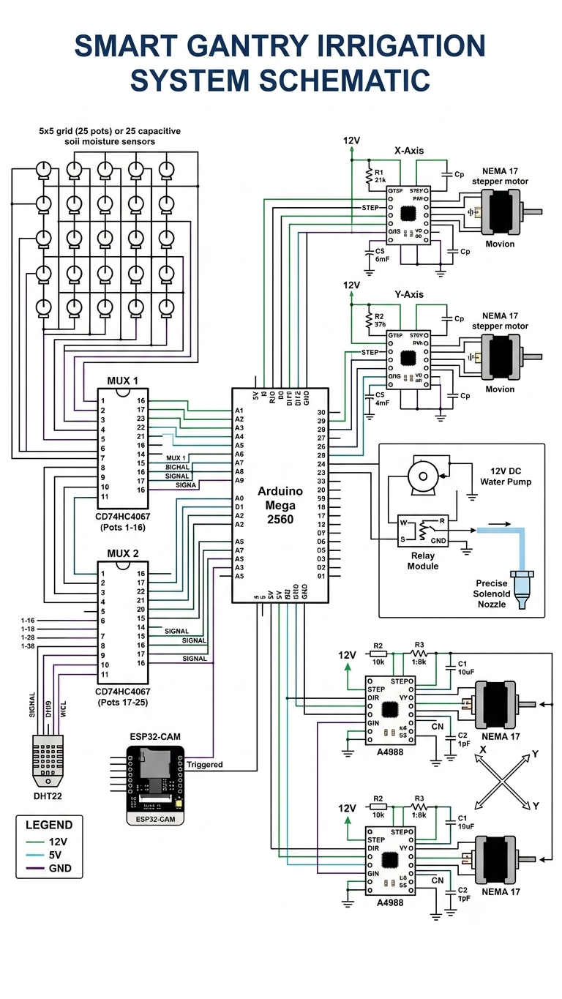

# 🤖 Automated Smart Gantry Irrigation Robot

An IoT-enabled, automated X-Y gantry robotic system designed for high-precision indoor farming, sensitive plant research, and micro-irrigation.


---

## 🌟 Key Features

* **Precision Micro-Irrigation:** Dual-axis (X-Y) gantry system delivers water specifically to plants needing hydration.
* **Multi-Sensor Soil Monitoring:** Reads 25 capacitive moisture sensors via dual 16-channel multiplexers (**CD74HC4067**).
* **Automated Growth Tracking:** Triggered **ESP32-CAM** module captures real-time images post-watering for plant growth logging.
* **Environmental Sensing:** Integrated **DHT22** sensor monitors ambient temperature and humidity.
* **Fully Autonomous:** Operates on an efficient cycle loop driven by an **Arduino Mega 2560**.

---

## 📐 System Architecture & Wiring



### Bill of Materials (BOM)

| Component | Quantity | Description |
| :--- | :---: | :--- |
| **Arduino Mega 2560** | 1 | Main System Controller |
| **CD74HC4067 Multiplexer** | 2 | 16-Channel Analog MUX for moisture sensors |
| **Capacitive Soil Moisture Sensor** | 25 | Corrosion-resistant soil sensors |
| **NEMA 17 Stepper Motors** | 2 | X-Y Axis Motion Drive |
| **A4988 Stepper Drivers** | 2 | Motor Controllers |
| **12V DC Water Pump** | 1 | Micro-Spraying Water Pump |
| **ESP32-CAM** | 1 | Image Capture & Wireless Logging Module |
| **DHT22 Sensor** | 1 | Ambient Temp & Humidity Monitoring |

---

## 🚀 How It Works

1. **Soil Moisture Scanning:** The system reads all 25 sensor values across the 5x5 grid.
2. **Pathfinding & Navigation:** If soil moisture drops below **35%**, the gantry head moves to the target $(X, Y)$ coordinate.
3. **Controlled Watering:** Activates the water spray nozzle for **12 seconds**.
4. **Visual Logging:** The ESP32-CAM captures a snapshot of the plant for growth analysis.
5. **Home & Sleep:** Returns to origin position $(0,0)$ and sleeps for 1 hour before the next cycle.

---

## 💻 Software & Installation

1. Clone this repository:
   ```bash
   git clone [https://github.com/YOUR_USERNAME/Smart-Gantry-Irrigation-Robot.git](https://github.com/YOUR_USERNAME/Smart-Gantry-Irrigation-Robot.git)
